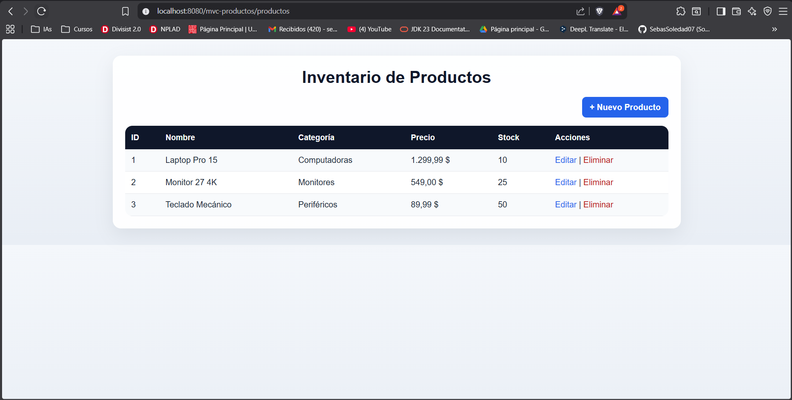
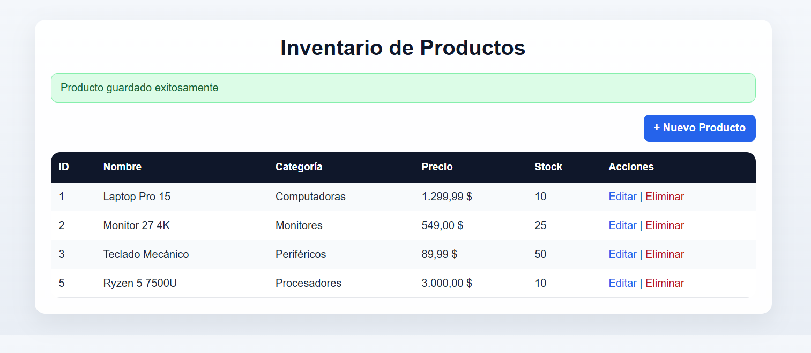
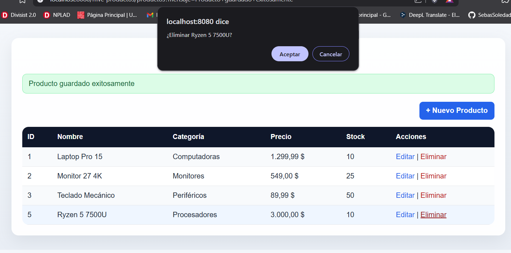
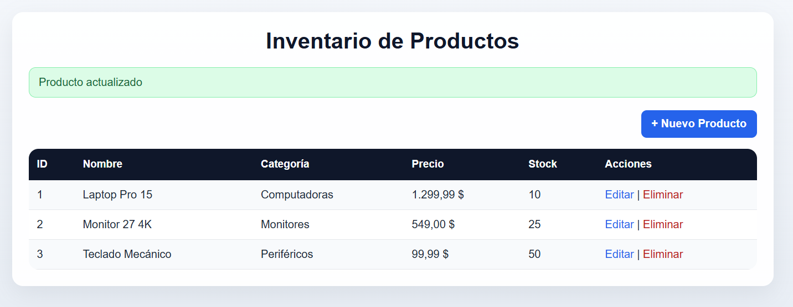
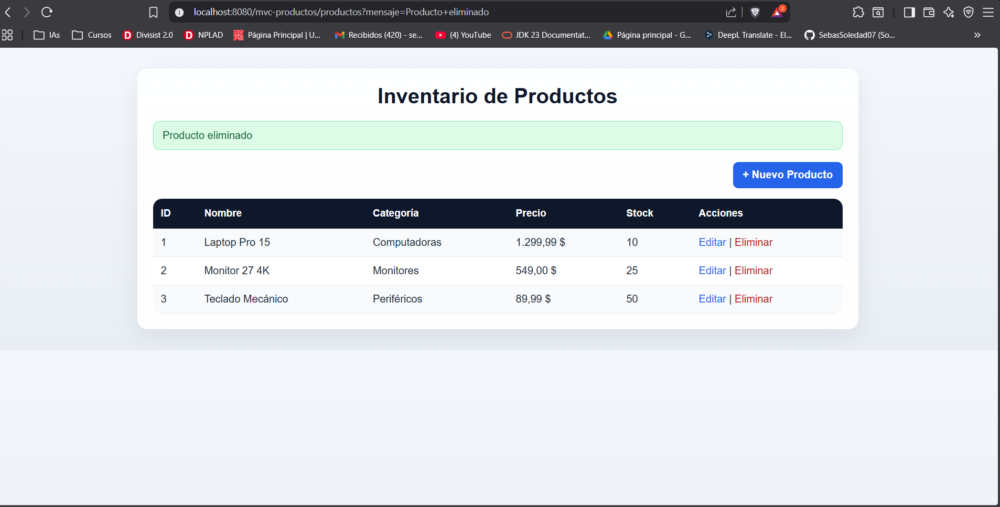

# MVC Productos

Aplicación web desarrollada con **Java**, **Jakarta Servlet**, **JSP** y **Maven** para gestionar un inventario básico de productos bajo el patrón **MVC**.

## Descripción del proyecto

Este proyecto permite administrar productos desde una interfaz web. La aplicación sigue una arquitectura MVC sencilla:

- **Modelo**: representa la entidad `Producto` y el acceso a datos mediante `ProductoDAO`.
- **Servicio**: contiene la lógica de negocio en `ProductoService`.
- **Controlador**: recibe las peticiones HTTP en `ProductoServlet` y coordina el flujo entre modelo y vistas.
- **Vistas**: páginas JSP para listar, crear, editar y eliminar productos.

Los datos se almacenan en memoria dentro del `ProductoDAO`, por lo que al reiniciar la aplicación se restablece la información inicial de ejemplo.

## Prerrequisitos

Antes de ejecutar el proyecto, asegúrate de contar con:

- **Java 8 o superior**
- **Apache Maven 3.x**
- **Apache Tomcat 10 o superior** compatible con **Jakarta EE**
- Un IDE como **IntelliJ IDEA**, **Eclipse** o **VS Code** con soporte para proyectos Maven

## Instrucciones de ejecución

### 1. Compilar el proyecto

Desde la raíz del proyecto ejecuta:

```powershell
mvn clean package
```

Esto genera el archivo `target/mvc-productos.war`.

### 2. Desplegar en Tomcat

Copiar el archivo `target/mvc-productos.war` al directorio `webapps` de Tomcat o desplegarlo desde tu IDE.

### 3. Iniciar el servidor

Arranca Tomcat y abre en el navegador:

```text
http://localhost:8080/mvc-productos/
```

La aplicación redirige automáticamente al listado de productos.

### 4. Flujo de uso

- Ver el inventario desde la vista principal.
- Crear un nuevo producto con el formulario.
- Editar un producto existente.
- Eliminar un producto con confirmación.
- Visualizar mensajes de éxito después de cada operación.

## Capturas

Las capturas se encuentran en `src/main/resources`.

### Listado de productos



### Crear producto



### Validación de datos



### Actualizar producto



### Eliminar producto



## Funcionalidades implementadas

- Listado de productos en una tabla con estilo visual.
- Registro de nuevos productos.
- Edición de productos existentes.
- Eliminación de productos con confirmación.
- Validaciones básicas en el servicio:
  - nombre obligatorio,
  - precio no negativo,
  - verificación de existencia antes de actualizar.
- Mensajes de confirmación después de guardar, actualizar y eliminar.
- Plantillas JSP con JSTL para mostrar datos dinámicos.
- Estilos CSS personalizados para mejorar la presentación.

## Estructura principal del proyecto

```text
src/main/java/com/universidad/mvc/controller/ProductoServlet.java
src/main/java/com/universidad/mvc/model/Producto.java
src/main/java/com/universidad/mvc/model/ProductoDAO.java
src/main/java/com/universidad/mvc/service/ProductoService.java
src/main/webapp/WEB-INF/views/lista.jsp
src/main/webapp/WEB-INF/views/formulario.jsp
src/main/webapp/css/estilos.css
```

## Notas

- La aplicación usa datos en memoria, por lo que no requiere base de datos.
- Si cambias de contenedor, asegúrate de usar una versión compatible con Jakarta Servlet.
- Si las imágenes no se muestran en GitHub, revisa que el proyecto conserve la ruta `src/main/resources/` al publicarlo.

